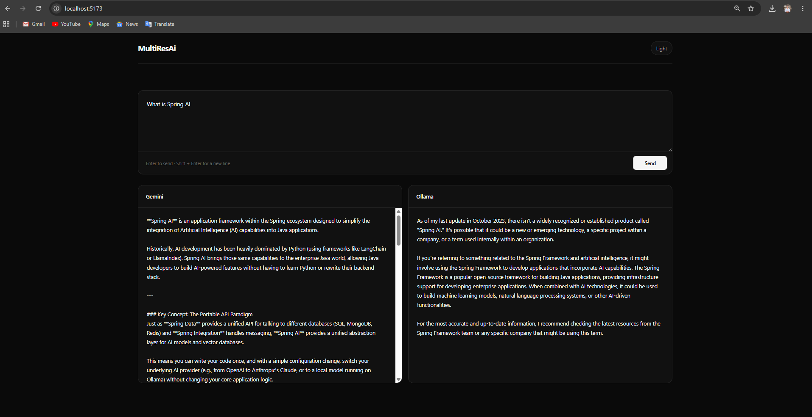

# MultiResAi

MultiResAi is a simple AI application built with **Spring AI** that
sends the same user prompt to two different AI models and displays their
responses side by side.

The project demonstrates the integration of:

-   **Google Gemini** as a cloud-based AI model
-   **Ollama with Qwen Code 14B** as a locally running AI model

The frontend provides a single prompt interface, while the backend
handles communication with both AI models through Spring AI.

## Screenshot



## How It Works

``` text
                    User Prompt
                        |
                        v
                 React Frontend
                        |
                        v
                Spring Boot Backend
                        |
                     Spring AI
                    /                           /                            v            v
           Google Gemini     Ollama
              Cloud         Local Qwen
                  |             |
                  v             v
             Gemini Response  Ollama Response
                  \             /
                   \           /
                    v         v
                 React Frontend
                   |       |
                   v       v
                Gemini   Ollama
                Response Response
```

A single prompt is sent to the backend. The backend sends that prompt to
both configured AI models. The resulting responses are returned to the
frontend and displayed independently.

## Backend

The backend is built with **Spring Boot** and **Spring AI**.

Spring AI provides the integration layer between the Spring Boot
application and the AI models.

### Google Gemini

Google Gemini is integrated as the cloud-based AI provider through
Spring AI's Google GenAI integration.

The backend receives the user's prompt and passes it to the configured
Gemini chat model through Spring AI.

### Ollama

Ollama runs locally and hosts the **Qwen Code 14B** model.

Spring AI communicates with the locally running Ollama instance and
sends the same prompt to the Qwen model.

This demonstrates the use of both a cloud AI provider and a locally
hosted AI model within the same Spring Boot application.

## Frontend

The frontend is built with:

-   React
-   Vite
-   JavaScript
-   CSS

Its primary purpose is to provide the prompt interface and display the
two responses returned by the backend.

The frontend does not contain Gemini or Ollama API logic. It
communicates with the Spring Boot backend.

The backend base URL is configured through:

``` env
VITE_API_BASE_URL=http://localhost:8080/api
```

## Technologies

### Frontend

-   React
-   Vite
-   JavaScript
-   CSS

### Backend

-   Java
-   Spring Boot
-   Spring AI
-   Spring Web

### AI

-   Google Gemini API
-   Ollama
-   Qwen Code 14B

## Running the Project

### Backend

Start Ollama and make sure the Qwen Code 14B model is available locally.

Then start the Spring Boot application:

``` bash
mvn spring-boot:run
```

The backend runs on:

``` text
http://localhost:8080
```

### Frontend

From the frontend directory:

``` bash
npm install
npm run dev
```

The frontend runs through the Vite development server, normally at:

``` text
http://localhost:5173
```

## Environment Configuration

The frontend requires the backend base URL in `.env`:

``` env
VITE_API_BASE_URL=http://localhost:8080/api
```

The Gemini API key is configured on the backend and should not be
exposed to the frontend.

Ollama runs locally and does not require the frontend to directly access
the model.

## Project Purpose

MultiResAi demonstrates how **Spring AI can be used to integrate
different types of AI providers in the same Spring Boot application**.

The project combines a cloud-hosted Gemini model with a locally hosted
Qwen model through Ollama and provides a single interface for sending
the same prompt to both.
